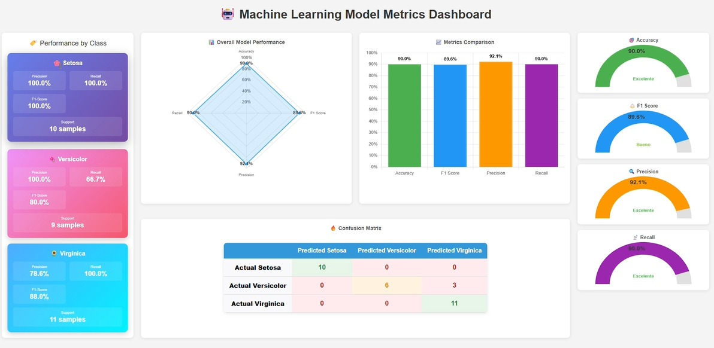

# 🤖 ML Model Dashboard - Iris Classification

[](https://python.org)
[](https://flask.palletsprojects.com/)
[](https://scikit-learn.org/)
[](https://opensource.org/licenses/MIT)

Una aplicación web completa para entrenar, evaluar y visualizar modelos de Machine Learning usando el clásico dataset Iris. El proyecto incluye un dashboard interactivo con múltiples visualizaciones de métricas y una API RESTful para realizar predicciones.

## 📋 Características

- 🤖 **Entrenamiento automatizado** de modelo de regresión logística
- 📊 **Dashboard interactivo** con visualizaciones en tiempo real
- 🔄 **API RESTful** completa para operaciones CRUD
- 📈 **Múltiples métricas** de evaluación (Accuracy, Precision, Recall, F1-Score, Matriz fr confusión y clasification report)
- 🎯 **Matriz de confusión** visual e interactiva
- 📱 **Diseño responsivo** y moderno
- 💾 **Almacenamiento persistente** con SQLite
- ⚡ **Actualización automática** de métricas cada 10 segundos

## 🎯 Demo



**Funcionalidades del Dashboard:**
- Gráficos tipo radar y barras para métricas generales
- Medidores (gauges) individuales para cada métrica
- Matriz de confusión interactiva
- Tarjetas de rendimiento por clase de Iris
- Clasificación por colores según rendimiento

## 🚀 Instalación y Configuración

### Prerrequisitos

- Python 3.8 o superior
- pip (gestor de paquetes de Python)

### 1. Clonar el repositorio

```bash
git clone https://github.com/usuario/flask-model-dashboard.git
cd flask-model-dashboard
```

### 2. Crear entorno virtual

```bash
# Windows
python -m venv dashboard
dashboard\Scripts\activate

# Linux/macOS
python -m venv dashboard
source dashboard/bin/activate
```

### 3. Instalar dependencias

```bash
pip install -r requirements.txt

# Si es necesario, actualizar Flask-SQLAlchemy
pip install --upgrade Flask-SQLAlchemy
```

### 4. Entrenar el modelo

```bash
python model.py
```

Este comando generará:
- `model.pkl`: Modelo entrenado serializado
- `metrics.json`: Métricas de evaluación del modelo

### 5. Ejecutar la aplicación

```bash
python app.py
```

La aplicación estará disponible en: `http://127.0.0.1:5000`

## 📖 Uso de la Aplicación

### Dashboard Web

Accede al dashboard completo en: `http://127.0.0.1:5000/dashboard`

El dashboard incluye:
- **Vista general**: Gráfico radar con todas las métricas
- **Métricas detalladas**: Medidores individuales para cada métrica
- **Matriz de confusión**: Visualización interactiva de clasificaciones
- **Rendimiento por clase**: Tarjetas detalladas para Setosa, Versicolor y Virginica

### API Endpoints

La aplicación proporciona una API RESTful completa:

#### 1. Realizar nueva predicción
```bash
POST /predict
Content-Type: application/json

{
    "sepal_length": 5.1,
    "sepal_width": 3.5,
    "petal_length": 1.4,
    "petal_width": 0.2
}
```

#### 2. Obtener todas las predicciones
```bash
GET /predictions
```

#### 3. Actualizar predicción completa
```bash
PUT /prediction/{id}
Content-Type: application/json

{
    "sepal_length": 5.7,
    "sepal_width": 3.2,
    "petal_length": 1.5,
    "petal_width": 0.3
}
```

#### 4. Actualización parcial
```bash
PATCH /prediction/{id}
Content-Type: application/json

{
    "sepal_length": 5.8
}
```

#### 5. Obtener métricas del modelo
```bash
GET /metrics
```

### Ejemplos con CURL

```bash
# Nueva predicción
curl -X POST http://127.0.0.1:5000/predict \
  -H "Content-Type: application/json" \
  -d '{"sepal_length": 5.1, "sepal_width": 3.5, "petal_length": 1.4, "petal_width": 0.2}'

# Ver todas las predicciones
curl http://127.0.0.1:5000/predictions

# Obtener métricas
curl http://127.0.0.1:5000/metrics
```

## 🏗️ Estructura del Proyecto

```
flask-model-dashboard/
│
├── app.py                  # Aplicación Flask principal
├── model.py               # Entrenamiento y evaluación del modelo
├── iris.csv               # Dataset Iris
├── requirements.txt       # Dependencias Python
├── model.pkl              # Modelo entrenado (generado)
├── metrics.json           # Métricas del modelo (generado)
├── predictions.db         # Base de datos SQLite (generado)
│
├── templates/
│   └── dashboard.html     # Template HTML del dashboard
│
├── static/
│   ├── css/
│   │   └── styles.css     # Estilos CSS personalizados
│   └── js/
│   │   └── main.js        # JavaScript para gráficos interactivos
│   └── dashboard-preview.png
└── README.md              # Documentación del proyecto
```

## 🔧 Tecnologías Utilizadas

### Backend
- **Flask**: Framework web de Python
- **Flask-SQLAlchemy**: ORM para base de datos
- **Scikit-learn**: Biblioteca de Machine Learning
- **Pandas**: Manipulación de datos
- **Pickle**: Serialización del modelo

### Frontend
- **Chart.js**: Biblioteca para gráficos interactivos
- **HTML5/CSS3**: Estructura y estilos
- **JavaScript ES6**: Interactividad del cliente

### Base de Datos
- **SQLite**: Base de datos embebida para predicciones

## 📊 Métricas del Modelo

El modelo de regresión logística alcanza las siguientes métricas en el dataset de prueba:

| Métrica   | Valor  |
|-----------|--------|
| Accuracy  | 90.0%  |
| Precision | 92.1%  |
| Recall    | 90.0%  |
| F1-Score  | 89.6%  |

### Rendimiento por Clase

| Clase        | Precision | Recall | F1-Score | Support |
|--------------|-----------|--------|----------|---------|
| Setosa       | 100.0%    | 100.0% | 100.0%   | 10      |
| Versicolor   | 100.0%    | 66.7%  | 80.0%    | 9       |
| Virginica    | 78.6%     | 100.0% | 88.0%    | 11      |


## 🧪 Testing

### Probar la API con Postman

1. Importa la colección de endpoints
2. Configura la URL base: `http://tu-servidor:5000`
3. Ejecuta los tests de cada endpoint

### Validación del Modelo

```bash
# Re-entrenar y validar el modelo
python model.py

# Verificar métricas generadas
cat metrics.json
```
